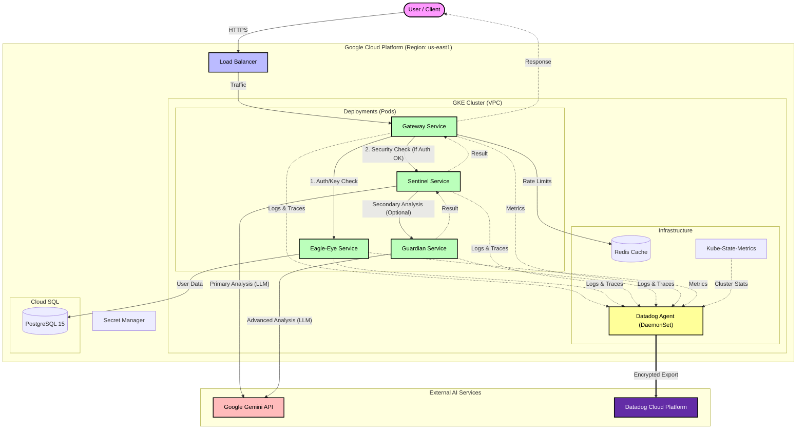
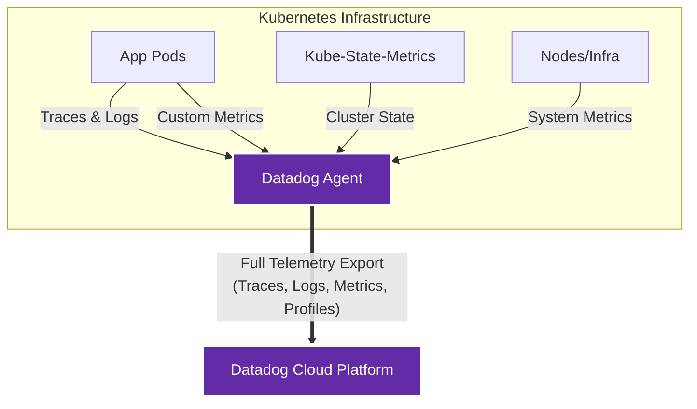

# Clestiq Shield - Infrastructure & Testing Repository

This repository manages the **infrastructure deployment** (GCP, GKE, CloudSQL) and contains the **testing scripts** (Chaos Engineering, Load Testing, Deployment validation) for the **Clestiq Shield** platform.

It ensures that the Clestiq Shield environment is reproducible, secure, and rigorously tested against various attack vectors.

## � Table of Contents

- [🏗️ System Architecture](#-system-architecture)
- [📂 Repository Structure](#-repository-structure)
- [🚀 Quick Start: Deployment](#-quick-start-deployment)
- [🧪 Testing & Chaos Engineering](#-testing--chaos-engineering)
- [📊 Observability (Datadog)](#-observability-datadog)

---

## 🏗️ System Architecture



---

## 📂 Repository Structure

- **`terraform/`**
  - Defines the Infrastructure as Code (IaC) for Google Cloud.
  - **Deploys**:
    - **GKE Cluster**: Zonal, auto-scaling managed node pool.
    - **CloudSQL**: PostgreSQL 15, Regional HA, Private IP only.
    - **VPC Network**: Custom subnet spanning the region.
    - **Firewall & DNS**: Security rules and networking setup.
- **`scripts/`**
  - PowerShell scripts for operational tasks.
  - **Deployment**:
    - `deploy.ps1`: Main deployment script. Deploys entire Terraform stack.
    - `deploy-k8s.ps1`: Deploys manifests + manages K8s secrets.
  - **Testing & Chaos**:
    - `trigger_all_alerts.ps1`: Chaos engineering script to simulate DDoS, Security threats, and Abuse.
    - `load_test.ps1`: Generates standard user/app/key traffic for load validation.
    - `test_rate_limits.ps1`: Specifically validates rate limiting logic.
  - **`k8s/`**
  - Kubernetes manifests for Clestiq Shield services (`gateway`, `eagle-eye`, `sentinel`, `guardian`).
  - Observability configs (`datadog-agent`, `kube-state-metrics`).
  - Infrastructure components (`redis`).

---

## 🚀 Quick Start: Deployment

### 1. Infrastructure (Terraform)
**Prerequisites**: `gcloud`, `terraform`.

1. Authenticate with Google Cloud and set project:
   ```bash
   gcloud auth application-default login
   gcloud config set project clestiq-shield
   ```

2. Run Infrastructure Deployment Script:
   ```powershell
   cd scripts
   # Ensure you have set configuration in terraform/terraform.tfvars (copy from .example)
   .\deploy.ps1
   ```

### 2. Application (Kubernetes)
**Prerequisites**: `kubectl`, `gcloud` (authenticated), `powershell`.

Use the automated deployment script which handles **Secret Creation** (from Terraform outputs) and **Manifest Application**.

```powershell
cd scripts
.\deploy-k8s.ps1
```

**What this script does:**
1. **Connects** to the GKE cluster using credentials from gcloud.
2. **Auto-creates Secrets**: It reads `terraform output` to fetch sensitivity data (DB credentials, API keys) and creates `db-secrets`, `datadog-secrets`, `eagle-eye-secrets`, and `gemini-secrets` in Kubernetes.
3. **Applies Manifests**: Deploys everything in `k8s/` folder.
4. **Patches Service**: Updates the Gateway LoadBalancer with the static IP reserved by Terraform.
5. **Waits**: Verifies that all deployments are ready.

---

## 🧪 Testing & Chaos Engineering

This repository includes a powerful chaos engineering suite to validate security blocking and alerting logic.

### 🛡️ Multi-Vector Simulation (`trigger_all_alerts.ps1`)
This script simulates **6 concurrent users** performing various attacks to trigger specific **Datadog Alerts**. Use this to test your monitoring and incident response.

```powershell
.\scripts\trigger_all_alerts.ps1
```

**Attack Vectors Simulated:**
| User | Attack Type | Expected Outcome | Signal |
|------|-------------|------------------|--------|
| 1 | **Rapid Key Creation** | Creates >5 keys in seconds | **P3 Abuse Alert** |
| 2 | **Token Usage Spike** | Consumes >5000 tokens immediately | **P2 Usage Alert** |
| 3 | **Force Blocking** | Repeated sets of 429s (Rate Limit) | **P3 Blocked Alert** |
| 4 | **Security Injection** | DAN/Jailbreak attempts | **P1 Security Alert** |
| 5-6 | **DDoS Noise** | Constant request flooding | 429 Rate Limits |

### 📈 Functional Load Test (`load_test.ps1`)
Generates valid users, apps, and keys to simulate normal (but busy) traffic. Useful for ensuring the system is functional under load without triggering abuse alerts.

```powershell
.\scripts\load_test.ps1 -Prefix "test_run_1"
```

---

## 📊 Observability (Datadog)

<div align="center">

**All Signals → One Platform**



</div>

The infrastructure includes a full **Datadog** deployment.
- **Manifest**: `k8s/datadog-agent.yaml`
- **Configuration**: The `deploy-k8s.ps1` script automatically pulls `datadog_api_key` and `datadog_app_key` from Terraform outputs.

**Enabled Features:**
- **APM**: Distributed tracing for all services.
- **Logs**: Container log collection.
- **Process**: Live process monitoring.
- **System Probe**: Network performance monitoring.
- **Kube Stats**: Cluster-level metrics via `kube-state-metrics`.